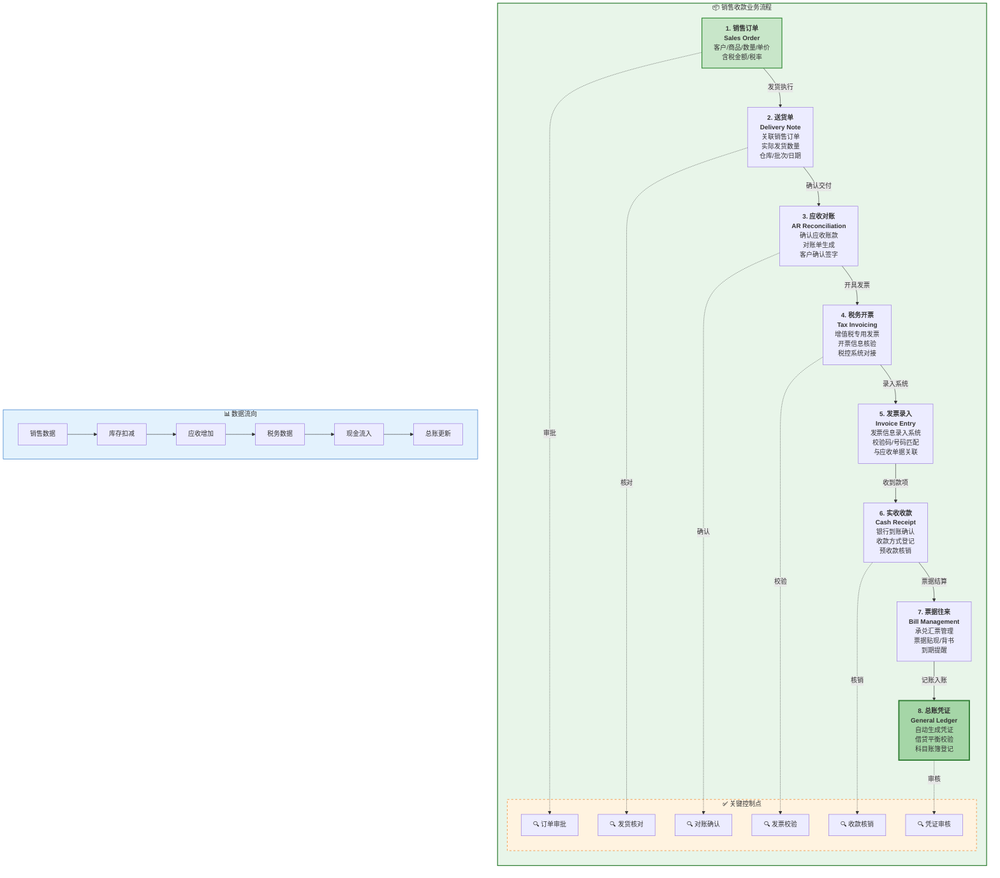
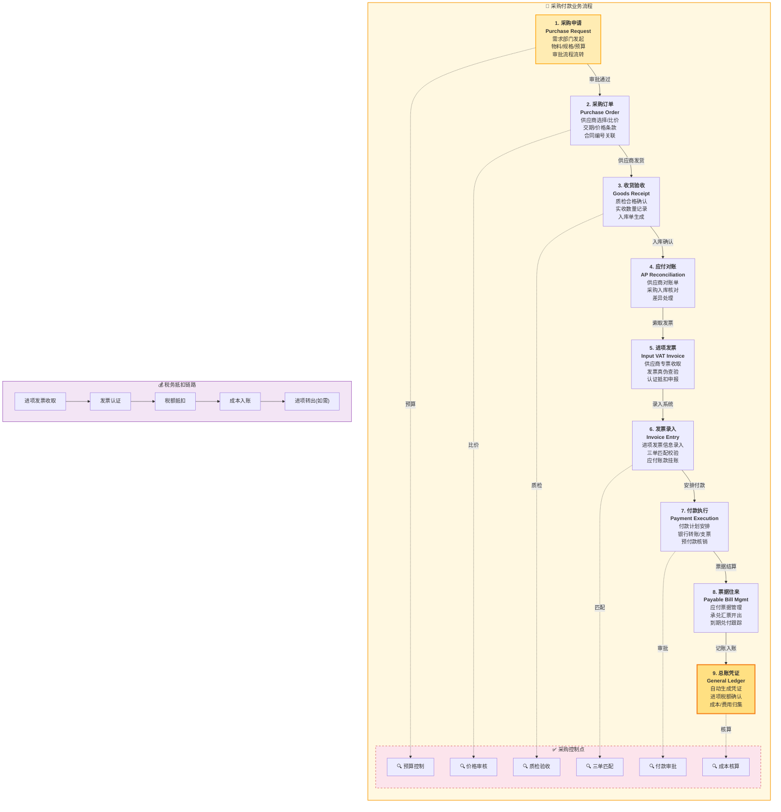
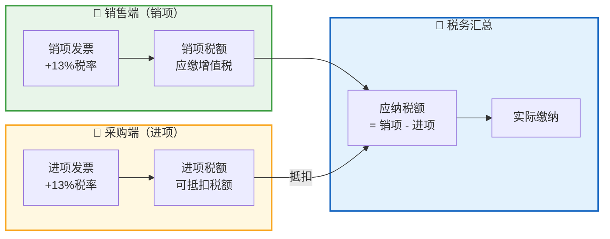

# ERP财务管理系统 - 业务流程图

## 流程一: 销售收款全流程（销售订单 → 总账）

---

## 流程二: 采购付款全流程（采购申请 → 总账）

---

## 两端联动关系图

---

## 与金蝶云星空模块对照表

| 序号 | 流程节点 | 金蝶云星空对应模块 | 核心功能 | 我们当前状态 |
|------|---------|-------------------|---------|-------------|
| 1 | 销售订单 | 销售管理 → 销售报价→订单 | 价格政策、信用检查 | ✅ 已规划 |
| 2 | 送货单 | 库存管理 → 发货通知→出库单 | 批次管理、可用量检查 | ✅ 已规划 |
| 3 | 应收对账 | 应收管理 → 应收单→对账单 | 账龄分析、预警 | ⚠️ 部分覆盖 |
| 4 | 税务开票 | 税务管理 → 开票管理 | 金税接口、电子发票 | ❌ 缺失 |
| 5 | 发票录入 | 发票管理 → 发票采集 | OCR识别、查验认证 | ❌ 缺失 |
| 6 | 实收收款 | 应收管理 → 收款单 | 银企联、核销规则 | ⚠️ 部分覆盖 |
| 7 | 票据往来 | 票据管理 | 汇票池、贴现计算 | ❌ 缺失 |
| 8 | **总账凭证** | **总账 → 凭证处理** | **自动凭证、期末处理** | **❌ 严重缺失** |
| 9 | 采购申请 | 采购管理 → 采购申请 | 请购单、预算控制 | ⚠️ 部分覆盖 |
| 10 | 采购订单 | 采购管理 → 采购订单 | 供应商管理、比价 | ⚠️ 部分覆盖 |
| 11 | 收货验收 | 质量管理 → 来料检验 | IQC、不合格处理 | ⚠️ 部分覆盖 |
| 12 | 应付对账 | 应付管理 → 应付单→对账 | 付款条件、账龄分析 | ⚠️ 部分覆盖 |
| 13 | 进项发票 | 发票管理 → 进项管理 | 认证抵扣、台账管理 | ❌ 缺失 |

---

> **绘制说明**: 本流程图基于金蝶云星空标准业务流程设计，涵盖从业务源头到财务闭环的完整链路。两个流程在总账节点汇合，实现业财一体化。
